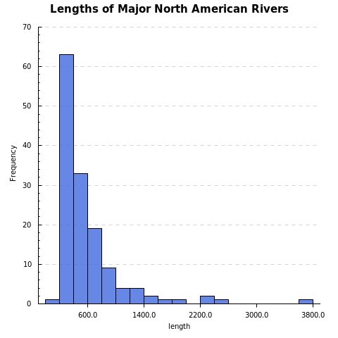
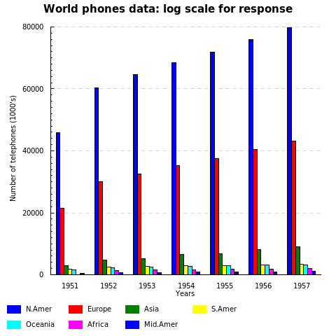

Haskell-Plot
=================

Simple plotting interface based on [haskell-chart](https://github.com/timbod7/haskell-chart).

Examples: (these examples are not compatible with version 0.1.0.0)

```haskell
import Graphics.Rendering.HPlot
import Data.DataSets (johnsonjohnson)

main = do
    (names, x:y:_) <- johnsonjohnson

    let ps = points (Just x, y) $ with & col .~ "green"
                                       & shape .~ 'o'
                                       & radius .~ 3
        l1 = line (Just x, y) $ with & lwd .~ 15
                                     & opacity .~ 0.2
                                     & col .~ "green"
        l2 = line (Just x, y) $ with & col .~ "black"

    plot' [l1, l2, ps] ( with & title .~ "Quarterly Earnings per Johnson & Johnson" 
                              & xlab .~ head names
                              & ylab .~ (names!!1)
                              & width .~ 800
                          ) "e1.png"
```


```haskell
import Graphics.Rendering.HPlot
import Data.DataSets (rivers)

main = do
    (_, x:_) <- rivers

    hist' x ( with & title .~ "Lengths of Major North American Rivers" 
                   & xlab .~ "length"
                   & col .~ "royalblue"
                   & opacity .~ 0.8 ) "e2.png"
```



```haskell
import Graphics.Rendering.HPlot
import Data.DataSets (worldphones)

main = do
    (label, ys) <- worldphones
    let bs = bars (Nothing, ys) $ with & legend .~ label
    plot' [bs] ( with & labels .~ map show [1951..1961]
                      & title .~ "World phones data: log scale for response"
                      & xlab .~ "Years"
                      & ylab .~ "Number of telephones (1000's)"
                      ) "e3.png"

```



```haskell
import Graphics.Rendering.HPlot
import Data.DataSets (anscombe)
import Data.Vector

main = do
    (labs, xs) <- anscombe

    heatmap' (fmap toList xs) (with & labRow .~ labs) "e4.png"
```


