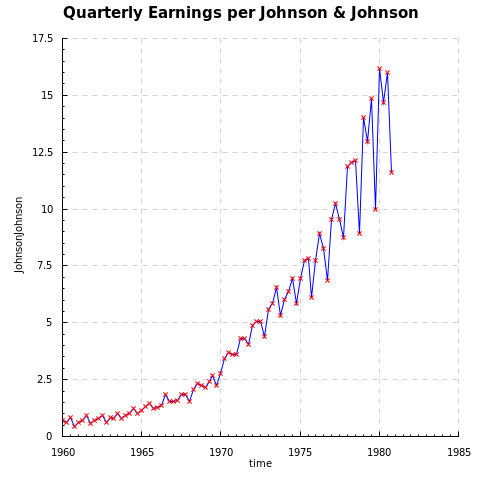
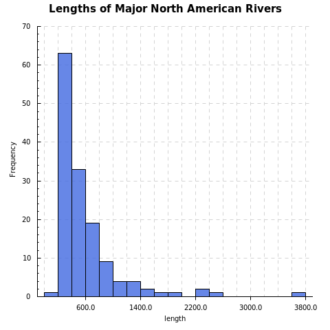

Haskell-Plot
=================

Simple plot interface based on [haskell-chart](https://github.com/timbod7/haskell-chart).

Examples:

```haskell
import Control.Lens
import Data.Default
import Graphics.Rendering.HPlot
import Data.DataSets (johnsonjohnson)

main = do
    (names, x:y:_) <- johnsonjohnson

    plot' (
        title .~ "Quarterly Earnings per Johnson & Johnson" 
        $ xlab .~ head names
        $ ylab .~ (names!!1)
        $ def) ( sequence [
            line def,
            points (
                p_col .~ "red" 
                $ p_shape .~ 'x'
                $ def)] (Just x, y) ) "e1.png"
```



```haskell
import Control.Lens
import Data.Default
import Graphics.Rendering.HPlot
import Data.DataSets (rivers)

main = do
    (_, x:_) <- rivers

    hist' (
        h_title .~ "Lengths of Major North American Rivers" 
        $ h_xlab .~ "length"
        $ h_col .~ "royalblue"
        $ h_opacity .~ 0.8
        $ def) x "e2.png"
```



```haskell
import Control.Lens
import Data.Default
import Graphics.Rendering.HPlot
import Data.DataSets (worldphones)

main = do
    (label, ys) <- worldphones

    plot' (labels .~ map show [1951..1961]
        $ title .~ "World phones data: log scale for response"
        $ xlab .~ "Years"
        $ ylab .~ "Number of telephones (1000's)"
        $ def) [
            bars (b_legend .~ label $ def) (Nothing, ys)] "e3.png"
```


