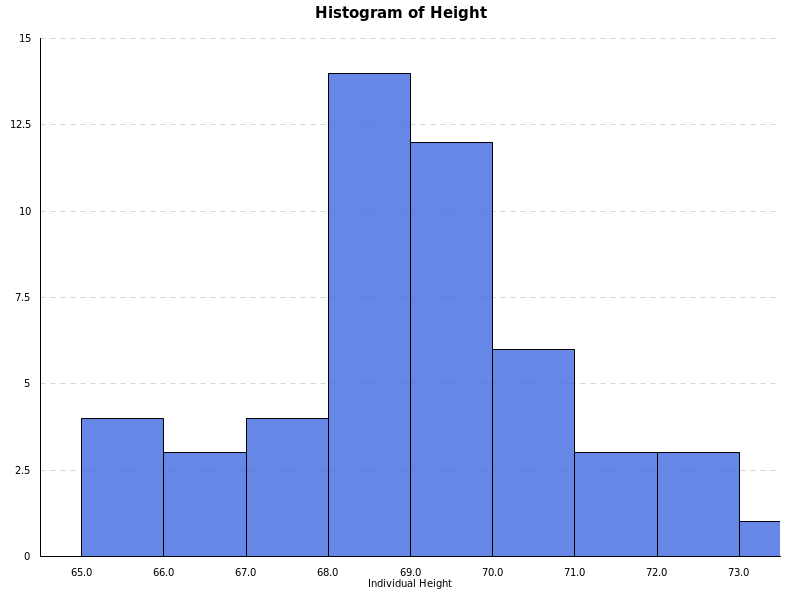
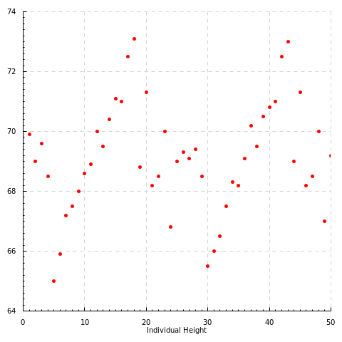

Histogram-haskell
=================

Simple plot interface based on [haskell-chart](https://github.com/timbod7/haskell-chart).

Example:

```haskell
import Type
import Hist
import Control.Lens
import DataSets
import Data.Default

main = hist' sample (
        common .~ (
            title .~ "Histogram of Height"
            $ xlab .~ "Individual Height"
            $ col .~ ["royalblue"]
            $ opacity .~ 0.8 
            $ def) 
        $ def) "test1.png"
```



```haskell
import Type
import Point
import Control.Lens
import DataSets
import Data.Default

main = points' (Nothing,sample) (
        common .~ (
            xlab .~ "Individual Height"
            $ col .~ "red"
            $ def)
        $ def) "test2.png"
```


