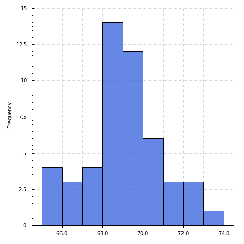
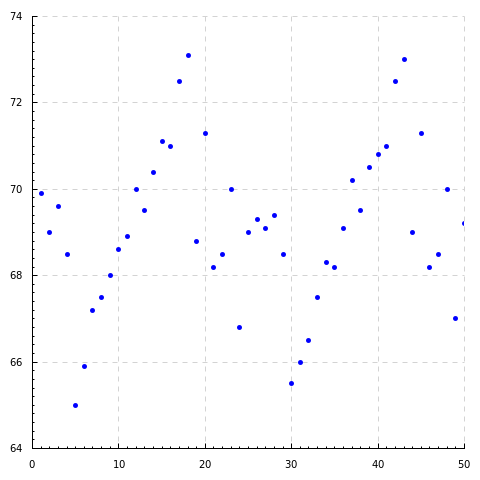
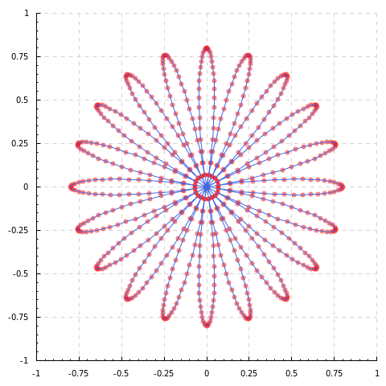

Haskell-Plot
=================

Simple plot interface based on [haskell-chart](https://github.com/timbod7/haskell-chart).

Examples:

```haskell
import Control.Lens
import Data.Default
import Graphics.Rendering.HPlot

main = hist' (
    h_col .~ "royalblue"
    $ h_opacity .~ 0.8
    $ def) sample "test1.png"
```



```haskell
p_opt :: PointOption
p_opt = p_shape .~ '^'
    $ p_col .~ "red"
    $ p_radius .~ 4
    $ def

l_opt :: LineOption
l_opt = l_type .~ 6
    $ def

main = plot' def (sequence [points p_opt, line l_opt] (Nothing,sample)) "test2.png"
```



```haskell
flower' = (_1 %~ Just $ flower)

main = plot' def (sequence [
    points (p_col .~ "red" $ p_opacity .~ 0.5 $ def),
    line (l_col .~ "royalblue" $ def)
    ] flower') "test3.png"
```


