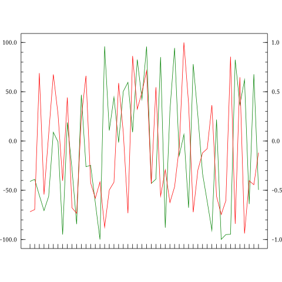

<h1 id="haskell-plot">Haskell-Plot</h1>

I'm starting from scratch to write a new plotting library based on <a href="http://projects.haskell.org/diagrams/">Diagrams</a>. The old package can be found in the &quot;Old&quot; directory.

<h1 id="header">Header</h1>
<pre class="sourceCode literate haskell"><code class="sourceCode haskell">{-# LANGUAGE OverloadedStrings #-}
{-# LANGUAGE TemplateHaskell #-}
{-# LANGUAGE UnicodeSyntax #-}</code></pre>
<pre class="sourceCode literate haskell"><code class="sourceCode haskell">import Diagrams.Prelude
import Diagrams.Backend.SVG
import Data.Default
import System.Random
import Graphics.Rendering.HPlot</code></pre>
<h1 id="make-axis">Make axis</h1>

Currently the <strong>Axis</strong> type contains three components:

<ol style="list-style-type: decimal">
<li>point map</li>
<li>labels and their positions</li>
<li>the actual axis with type &quot;Diagram B R2&quot;</li>
</ol>

We usually do not create <strong>Axis</strong> directly, instead, we creat a function which take a number (the length of axis) and generate the axis. Such functions are wrapped in the <strong>AxisFn</strong> type. <strong>AxisFn</strong>s are building blocks of chart. I wrote some general functions to help create <strong>AxisFn</strong>, i.e., realAxis, indexAxis, emptyAxis.

<pre class="sourceCode literate haskell"><code class="sourceCode haskell">xs ∷ [Double]
xs = take 50 $ randomRs (-100, 100) $ mkStdGen 2

ys ∷ [Double]
ys = take 50 $ randomRs (-100, 100) $ mkStdGen 4

xAxis ∷ AxisFn
xAxis = realAxis (minimum xs, maximum xs) 0.2 def

yAxis ∷ AxisFn
yAxis = realAxis (minimum ys, maximum ys) 0.2 def</code></pre>

The <strong>PlotArea</strong> contains four axes: left axis, top axis, right axis and bottom axis. We can use <strong>plotArea</strong> to create a <strong>PlotArea</strong>.

<pre class="sourceCode literate haskell"><code class="sourceCode haskell">area ∷ PlotArea
area = plotArea 5.5 4.8
       ( yAxis  -- left axis
       , def  -- top axis, using default axis which is a line
       , def  -- right axis
       , xAxis -- bottom axis
       )</code></pre>

<strong>PlotArea</strong> can be converted to a Diagram by <strong>showPlot</strong>.

<pre class="sourceCode literate haskell"><code class="sourceCode haskell">areaDiag ∷ Diagram B R2
areaDiag = (showPlot area) </code></pre>

Now that we have the plotArea, we can start adding actual plots. For example, we can use points to make point plot:

<pre class="sourceCode literate haskell"><code class="sourceCode haskell">ps = points xs ys def</code></pre>
<pre class="sourceCode literate haskell"><code class="sourceCode haskell">pointPlot = area &lt;+ (ps, BL) -- attach plot to plot area according to bottom and left axes</code></pre>

You can attach any number of plots to plotArea:

<pre class="sourceCode literate haskell"><code class="sourceCode haskell">ls = line xs ys def
linePointPlot = area &lt;+ (ps, BL) &lt;+ (ls, BL)</code></pre>

You can create an indexed Axis by indexAxis:

<pre class="sourceCode literate haskell"><code class="sourceCode haskell">bottomAxis = indexAxis 50 [] 0.2 def</code></pre>

Now let's create a plot area with 3 axes: left, bottom and right

<pre class="sourceCode literate haskell"><code class="sourceCode haskell">ys&#39; ∷ [Double]
ys&#39; = take 50 $ randomRs (-1, 1) $ mkStdGen 2

yAxis&#39; = realAxis (minimum ys&#39;, maximum ys&#39;) 0.2 def

area&#39; = plotArea 5.5 4.8 (yAxis, def, yAxis&#39;, bottomAxis)

l1 = line Nothing ys def # lc green
l2 = line Nothing ys&#39; def # lc red

plot = area&#39; &lt;+ (l1, BL) &lt;+ (l2, BR)</code></pre>

Note that the green line is placed according to left axis, and the red line is placed according to right axis.

<pre class="sourceCode literate haskell"><code class="sourceCode haskell">main = renderSVG &quot;doublePlot.svg&quot; (Dims 480 480) $ showPlot plot</code></pre>
