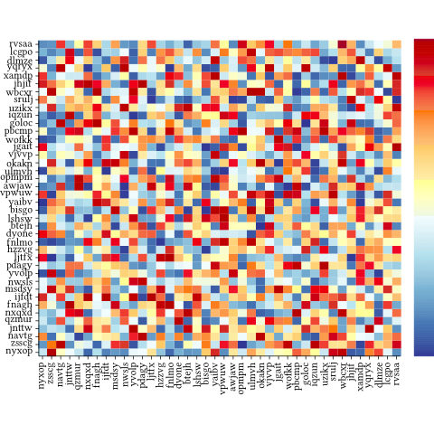

```haskell
import Diagrams.Prelude
import Diagrams.Backend.SVG
import Data.Default
import Graphics.Rendering.HPlot
import System.Random
import Data.List.Split
import Control.Lens ((^.))

xs :: [[Double]]
xs = chunksOf 30.take 900.randomRs (-100, 100).mkStdGen $ 2

labels :: [String]
labels = chunksOf 5.take 150.randomRs ('a', 'z').mkStdGen $ 22

main = do
    let xaxis = indexAxis 30 labels 0.09
                $ with & tickLen .~ (-0.05)
                       & labelOpts .~ (with & labelRotation .~ (1/4))
        yaxis = indexAxis 30 labels 0.09 $ with & tickLen .~ (-0.05)
        area = plotArea 5.5 4.8 (yaxis, emptyAxis, emptyAxis, xaxis)
        heat = heatmap xs def
        legend = colorKey 0.3 4.8 (minimum.concat $ xs, maximum.concat $ xs) (def^.palette)
        p = area <+ (heat, BL)
    renderSVG "1.svg" (Dims 480 480) $ showPlot p ||| strutX 0.2 ||| alignB legend
```
